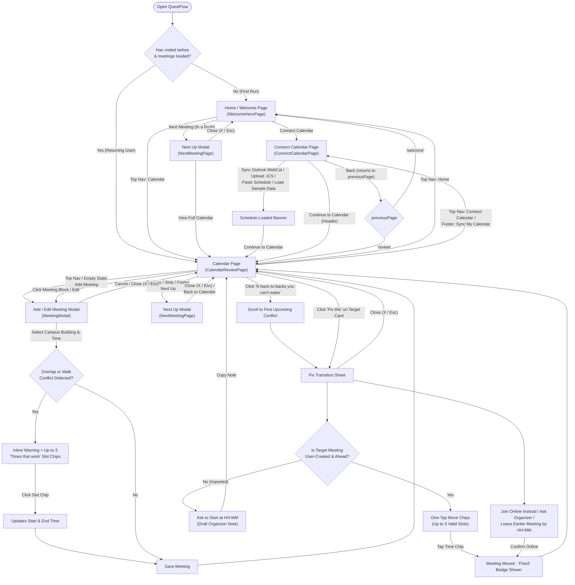

# QuestFlow — User Flow

```mermaid
flowchart TD
    Start(["Open QuestFlow"]) --> CheckVisited{"Has visited before\n& meetings loaded?"}

    CheckVisited -- "No (First Run)" --> Welcome["Home / Welcome Page\n(WelcomeHeroPage)"]
    CheckVisited -- "Yes (Returning User)" --> Calendar["Calendar Page\n(CalendarReviewPage)"]

    %% Welcome Page Actions
    Welcome -- "Connect Calendar" --> Connect["Connect Calendar Page\n(ConnectCalendarPage)"]
    Welcome -- "Next Meeting (In a Rush)" --> NextUpFromHome["Next Up Modal\n(NextMeetingPage)"]
    Welcome -- "Top Nav: Calendar" --> Calendar

    NextUpFromHome -- "Close (X / Esc)" --> Welcome
    NextUpFromHome -- "View Full Calendar" --> Calendar

    %% Connect Calendar Page Actions
    Connect -- "Sync Outlook WebCal / Upload .ICS /\nPaste Schedule / Load Sample Data" --> SyncSuccess["Schedule Loaded Banner"]
    SyncSuccess -- "Continue to Calendar" --> Calendar
    Connect -- "Continue to Calendar (Header)" --> Calendar
    Connect -- "Back (returns to previousPage)" --> PrevPage{"previousPage"}
    PrevPage -- "'welcome'" --> Welcome
    PrevPage -- "'review'" --> Calendar

    %% Calendar Page Actions
    Calendar -- "Top Nav: Home" --> Welcome
    Calendar -- "Top Nav: Connect Calendar /\nFooter: Sync My Calendar" --> Connect
    Calendar -- "Top Nav / Empty State:\nAdd Meeting" --> AddModal["Add / Edit Meeting Modal\n(MeetingModal)"]
    Calendar -- "Click Meeting Block / Edit" --> AddModal
    Calendar -- "Top Nav / Strip / Footer:\nNext Up" --> NextUpFromCal["Next Up Modal\n(NextMeetingPage)"]
    Calendar -- "Click 'N back-to-backs you can't make'" --> ScrollProblem["Scroll to First Upcoming Conflict"]
    ScrollProblem --> FixSheet["Fix Transition Sheet"]
    Calendar -- "Click 'Fix this' on Target Card" --> FixSheet

    %% Next Up Modal from Calendar
    NextUpFromCal -- "Close (X / Esc) /\nBack to Calendar" --> Calendar

    %% Add / Edit Meeting Modal (Prevent Flow)
    AddModal -- "Select Campus Building & Time" --> LiveCheck{"Overlap or Walk\nConflict Detected?"}
    LiveCheck -- "Yes" --> PreventWarn["Inline Warning + Up to 3\n'Times that work' Slot Chips"]
    PreventWarn -- "Click Slot Chip" --> UpdateTime["Updates Start & End Time"]
    UpdateTime --> SaveMeeting["Save Meeting"]
    LiveCheck -- "No" --> SaveMeeting
    AddModal -- "Cancel / Close (X / Esc)" --> Calendar
    SaveMeeting --> Calendar

    %% Fix Transition Sheet (Fix Flow)
    FixSheet --> TargetCheck{"Is Target Meeting\nUser-Created & Ahead?"}
    TargetCheck -- "Yes" --> DirectMove["One-Tap Move Chips\n(Up to 3 Valid Slots)"]
    TargetCheck -- "No (Imported)" --> AskStart["Ask to Start at HH:MM\n(Draft Organizer Note)"]
    FixSheet --> SecondaryFix["Join Online Instead / Ask Organizer /\nLeave Earlier Meeting by HH:MM"]
    DirectMove -- "Tap Time Chip" --> Resolved["Meeting Moved · 'Fixed' Badge Shown"]
    AskStart -- "Copy Note" --> Calendar
    SecondaryFix -- "Confirm Online" --> Resolved
    FixSheet -- "Close (X / Esc)" --> Calendar
    Resolved --> Calendar
```
